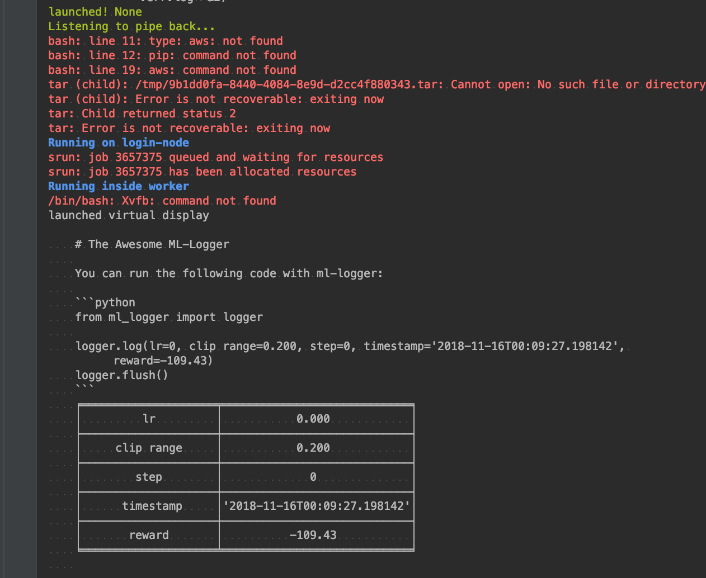

# Savio Cluster Starter Kit (with Jaynes [](http://pepy.tech/project/jaynes)⤵️) <a href="https://github.com/episodeyang/jaynes" target="_blank"></a>

<!--[](http://hits.dwyl.io/episodeyang/savio-starter-kit)-->

This kit contains a minimal example project for launching and monitoring
python ML jobs on the BRC Savio cluster.

## Getting Started with [./Makefile](./Makefile)

The Laurence National Lab Savio cluster requires 2-factor authentication (2FA) to login. 
Because you can only use the code once every 30 seconds, if you are trying to launch
new experiments every other 10 seconds that would not do.

This is why you want to setup an ssh tunnel connection locally. This binds
the ssh connection session to your local port. Then you can ssh to this local
port (41000 in this folder) without having to type in the password and the
security code. However, the ssh daemon on the login node disables the `tcp port forwarding`
option of `sshd`. As a result, we need to fall back onto a managed ssh connection
that stays active in the background (handled automatically by your standard issue ssh client).
This way, we can programmatically launch jobs on the Savio cluster without
authenticating each time.

The make file contains scripts that you can use to build TCP tunnel, but it won't apply here.

- `make ssh`: make an ssh connection to the cluster
- `make tunnel`: builds the tunnel in the current process (blocking)
- `make tunnel-background`: builds the tunnel in a separate process
- `make ssh-local`: ssh to the local forward port
- `make kill-all-tunnels`: finds all of the running tunnels (by regex) and kill them

## Configuring your ssh client so that you don't have to 2FA everytime

> with the caveat that you can only have 1 concurrent connection in the background

Add the following to your `~/.ssh/config` file: (file is available in this repo under
[./ssh_config](./ssh_config))

```
Host hpc.brc.berkeley.edu
  ControlPath ~/.ssh/cm-%r@%h:%p
  ControlMaster auto
  ControlPersist 300m
```

Now, if you do `make ssh`, the second time after the first connection (after disconnect)
would not require 2FA. This is what we need to launch stuff on the cluster automatically.

## Launching your local python codebase on Savio with [`Jayens`](https://github.com/episodeyang/jaynes)

The example project we have is called [./your-future-ICLR-best-paper](your-future-ICLR-best-paper). Inside, 
there is a `jaynes.yml` configuration file. This is the config file for your jaynes launcher. it specifies
which package we want to upload, to which aws s3 bucket etc, and what to do once you are inside your
host.

```bash
➜ tree your-future-ICLR-best-paper 

your-future-ICLR-best-paper
├── jaynes.yml
└── launch_entry.py

0 directories, 2 files
```

### Fill-in Your Username

To launch jobs, we need to put in your username for the ssh connection. Take a 
look at the `jaynes.yml` file, and do the following:

1. replace all `<your-username>` with, well, your lovely username!

### What is Jaynes?

`Jaynes` is an open-source tool for launching ML training jobs on heterogeneous compute platforms. It has a 
minimal foot-print--the only thing you need is a `jaynes.yml` config file under the root of your
project repo, the same way `.gitconfig` is for your git repo.

Jaynes allows you to launch hundreds :100: of hyper-parameter runs within seconds, all from the comfort of your IDE. 
Because it requires no change to your code, you can run the same code locally in a debugger and as a 
remote SLRM job.

This represents the most delightful developer experience for ML job launching at the moment. 

- No more stale code on your cluster servers
- Version-controlled runs as tar-balls (supports S3 buckets)
- Sweep hyper-parameters with a simple python for-loop.
- Easily switch between AWS, your own server via SSH, and different SLURM clusters.



### Install Jaynes (and the awesome ML-Logger)

Now, you can try to run the [./your-future-ICLR-best-paper/launch_entry.py](./your-future-ICLR-best-paper/launch_entry.py)
after installing `jaynes`. Jaynes works even better when you can log everything to a single "instrumentation server"!
This is why we also install [ML-Logger](https://github.com/episodeyang/ml_logger).

```bash
pip install jaynes ml-logger
```

### Installing Packages Inside Savio (your user directory)

Now try to log into the login node using `make ssh`. We need to install `jaynes`
in this environment so that it is available for the boostrap process. The code
downloading needs `awscli`. It is also useful to have `ml-logger` for distributed
logging.

```python
module load python/3.6
pip install jaynes awscli ml-logger --user
```

#### Gym and MuJoCo-py

For `mujoco-py` server-side rendering, you need to load the `glfw` module.

```bash
module load glfw
```


#### PyTorch

The Pytorch versions you requested should soon be available (taking awhile 
to install). We already have pytorch/0.3.1-py3.5-cuda9.0. You can also install 
Python packages yourself using the --user flag with pip, such as:
 
```bash
module load python/3.6
pip install torch torchvision --user
```

#### TensorFlow

```bash
module load tensorflow/1.10.0-py36-pip-cpu
```


### Now Profit!!

Now you can run the [launch_entry.py](./your-future-ICLR-best-paper/launch_entry.py) script. In pycharm and VS Code, 
this means that you can pick any python script in your code base, and run it in-place by just calling:

```python
import jaynes

jaynes.run(your_python_function, *args, **keyword_args)
```


